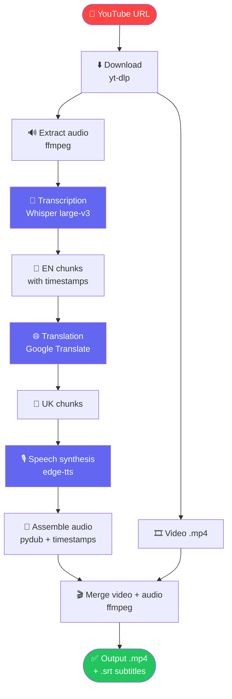

# YouTube UA Dubbing

> 🇺🇦 [Українська версія](README.ua.md)

Automatic dubbing of YouTube videos from English to Ukrainian.

## Pipeline



## Features

- Audio transcription via **[Whisper large-v3](https://github.com/openai/whisper)** (OpenAI)
- Translation via **[Google Translate](https://pypi.org/project/deep-translator/)** (EN → UK)
- Ukrainian speech synthesis via **[edge-tts](https://github.com/rany2/edge-tts)** (Microsoft)
  - `uk-UA-PolinaNeural` — female voice
  - `uk-UA-OstapNeural` — male voice
- Final video assembly via **[ffmpeg](https://ffmpeg.org/)** with original video track
- Subtitle generation in `.srt` format
- Web interface via **[Gradio](https://www.gradio.app/)**

## Requirements

- Python 3.9–3.12
- GPU (T4 or higher recommended for Whisper)
- Internet connection (for Google Translate and edge-tts)

## Running in Google Colab

1. Open `YouTube_UA_Dubbing.ipynb` in [Google Colab](https://colab.research.google.com/)
2. `Runtime → Change runtime type → T4 GPU`
3. Run cells in order (steps 1–5)
4. Enter a YouTube URL in the Gradio interface and click **Start dubbing**

## Project Structure

```
YouTube_UA_Dubbing.ipynb   # Main notebook
pipeline.py                # Extracted pipeline module
tests/
└── test_pipeline.py       # 45 unit tests
README.md                  # English docs
README.ua.md               # Ukrainian docs
.gitignore
```

## Dependencies

| Package | Purpose |
|---|---|
| [`faster-whisper`](https://github.com/SYSTRAN/faster-whisper) | Audio transcription |
| [`deep-translator`](https://github.com/nidhaloff/deep-translator) | EN → UK translation |
| [`edge-tts`](https://github.com/rany2/edge-tts) | Ukrainian speech synthesis |
| [`yt-dlp`](https://github.com/yt-dlp/yt-dlp) | YouTube video download |
| [`pydub`](https://github.com/jiaaro/pydub) | Audio processing and timing |
| [`gradio`](https://www.gradio.app/) | Web interface |
| [`ffmpeg`](https://ffmpeg.org/) | Final video assembly |

## Notes

- **edge-tts** requires an active internet connection (Microsoft cloud service)
- Lip-sync is not implemented — a separate [Wav2Lip](https://github.com/Rudrabha/Wav2Lip) step is needed for that
- Free Colab session: up to 12 hours
