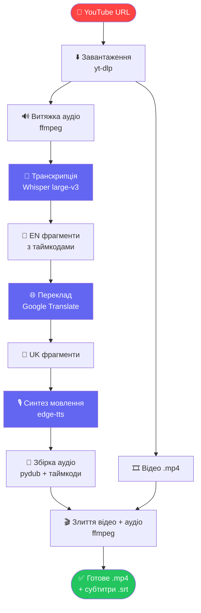

# YouTube UA Dubbing

> 🇬🇧 [English version](README.md)

Автоматичне дублювання YouTube відео з англійської на українську мову.

## Пайплайн



## Можливості

- Транскрипція аудіо через **[Whisper large-v3](https://github.com/openai/whisper)** (OpenAI)
- Переклад через **[Google Translate](https://pypi.org/project/deep-translator/)** (EN → UK)
- Синтез українського мовлення через **[edge-tts](https://github.com/rany2/edge-tts)** (Microsoft)
  - `uk-UA-PolinaNeural` — жіночий голос
  - `uk-UA-OstapNeural` — чоловічий голос
- Збірка фінального відео через **[ffmpeg](https://ffmpeg.org/)** з оригінальним відеорядом
- Генерація субтитрів у форматі `.srt`
- Веб-інтерфейс через **[Gradio](https://www.gradio.app/)**

## Вимоги

- Python 3.9–3.12
- GPU (рекомендовано T4 або вище для Whisper)
- Інтернет-з'єднання (для Google Translate та edge-tts)

## Запуск у Google Colab

1. Відкрий `YouTube_UA_Dubbing.ipynb` у [Google Colab](https://colab.research.google.com/)
2. `Runtime → Change runtime type → T4 GPU`
3. Запускай клітинки по порядку (кроки 1–5)
4. Введи YouTube посилання у Gradio інтерфейсі та натисни **Запустити дублювання**

## Структура проєкту

```
YouTube_UA_Dubbing.ipynb   # Основний ноутбук
pipeline.py                # Витягнутий модуль пайплайну
tests/
└── test_pipeline.py       # 45 unit-тестів
README.md                  # Документація англійською
README.ua.md               # Документація українською
.gitignore
```

## Залежності

| Пакет | Призначення |
|---|---|
| [`faster-whisper`](https://github.com/SYSTRAN/faster-whisper) | Транскрипція аудіо |
| [`deep-translator`](https://github.com/nidhaloff/deep-translator) | Переклад EN → UK |
| [`edge-tts`](https://github.com/rany2/edge-tts) | Синтез українського мовлення |
| [`yt-dlp`](https://github.com/yt-dlp/yt-dlp) | Завантаження відео з YouTube |
| [`pydub`](https://github.com/jiaaro/pydub) | Обробка аудіо, таймінг фрагментів |
| [`gradio`](https://www.gradio.app/) | Веб-інтерфейс |
| [`ffmpeg`](https://ffmpeg.org/) | Збірка фінального відео |

## Примітки

- **edge-tts** вимагає активного інтернет-з'єднання (хмарний сервіс Microsoft)
- Lip-sync не реалізовано — для цього потрібен окремий крок з [Wav2Lip](https://github.com/Rudrabha/Wav2Lip)
- Безкоштовний Colab-сеанс: до 12 годин
