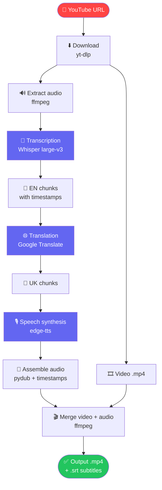
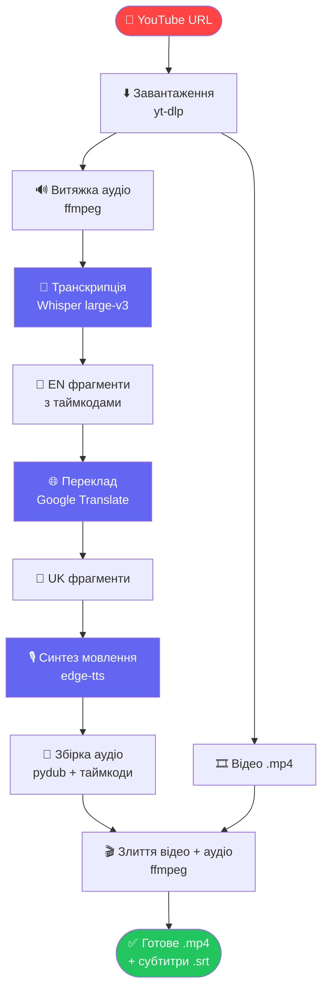

# Pipeline Diagram / Діаграма пайплайну

> 🇬🇧 English · 🇺🇦 [Українська](../README.ua.md)

## English

```mermaid
flowchart TD
    A([🔗 YouTube URL]) --> B[⬇️ Download\nyt-dlp]
    B --> C[🎞️ Video .mp4]
    B --> D[🔊 Extract audio\nffmpeg]
    D --> E[📝 Transcription\nWhisper large-v3]
    E --> F[💬 EN chunks\nwith timestamps]
    F --> G[🌐 Translation\nGoogle Translate]
    G --> H[💬 UK chunks]
    H --> I[🎙️ Speech synthesis\nedge-tts]
    I --> J[🔧 Assemble audio\npydub + timestamps]
    J --> K[🎬 Merge video + audio\nffmpeg]
    C --> K
    K --> L([✅ Output .mp4\n+ .srt subtitles])

    style A fill:#ff4444,color:#fff
    style L fill:#22c55e,color:#fff
    style E fill:#6366f1,color:#fff
    style G fill:#6366f1,color:#fff
    style I fill:#6366f1,color:#fff
```

## Українська

```mermaid
flowchart TD
    A([🔗 YouTube URL]) --> B[⬇️ Завантаження\nyt-dlp]
    B --> C[🎞️ Відео .mp4]
    B --> D[🔊 Витяжка аудіо\nffmpeg]
    D --> E[📝 Транскрипція\nWhisper large-v3]
    E --> F[💬 EN фрагменти\nз таймкодами]
    F --> G[🌐 Переклад\nGoogle Translate]
    G --> H[💬 UK фрагменти]
    H --> I[🎙️ Синтез мовлення\nedge-tts]
    I --> J[🔧 Збірка аудіо\npydub + таймкоди]
    J --> K[🎬 Злиття відео + аудіо\nffmpeg]
    C --> K
    K --> L([✅ Готове .mp4\n+ субтитри .srt])

    style A fill:#ff4444,color:#fff
    style L fill:#22c55e,color:#fff
    style E fill:#6366f1,color:#fff
    style G fill:#6366f1,color:#fff
    style I fill:#6366f1,color:#fff
```
